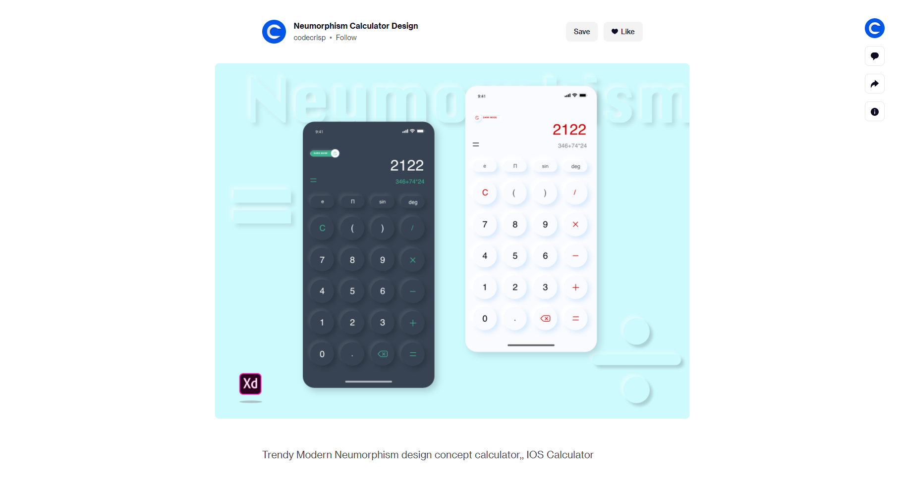

# Simple calculator
My very first ReactJS project - Building simple calculator in neumorphism style.

Try it [here](https://vlozg.github.io/simple-calculator/)!

---
## Reference: [Neumorphism Calculator Design - codecrisp](https://dribbble.com/shots/12216116-Neumorphism-Calculator-Design?utm_source=Clipboard_Shot&utm_campaign=codecrisp&utm_content=Neumorphism%20Calculator%20Design&utm_medium=Social_Share)

